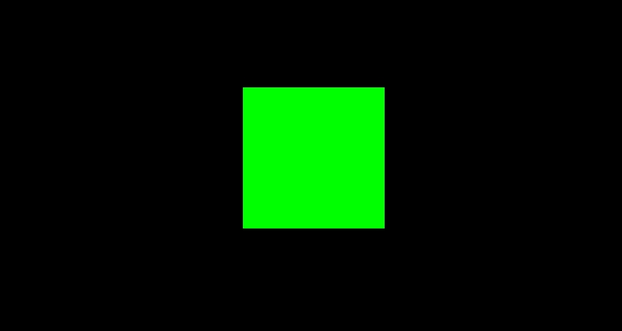
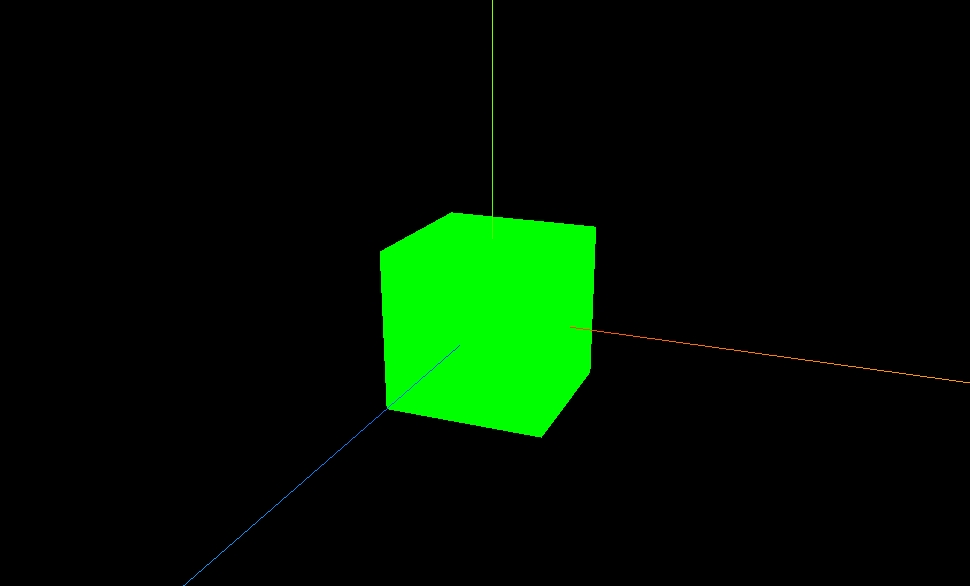
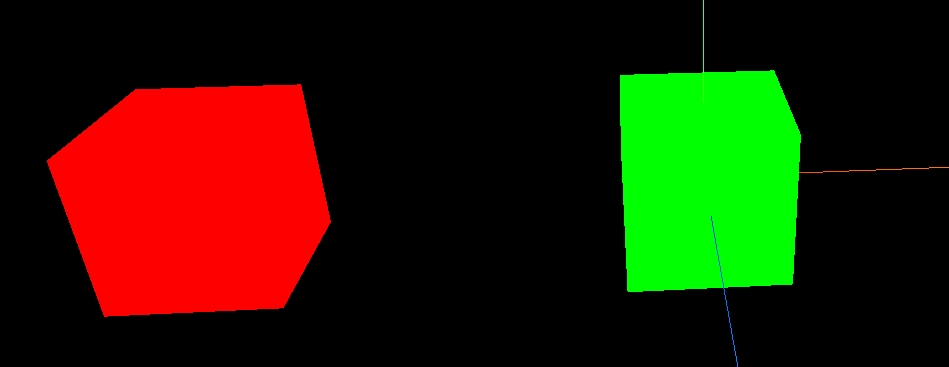
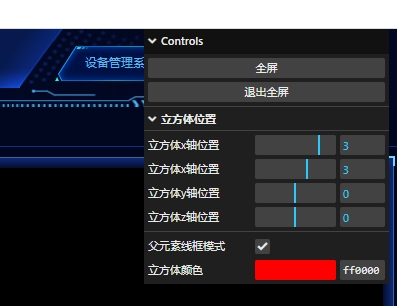

# three.js学习

## 一、初始three.js

官网[three.js](https://threejs.org/)，访问比较慢，我们可以把它部署在本地进行访问，git地址[mrdoob/three.js](https://github.com/mrdoob/three.js/)，把源码下载下来以后，到项目根目录`three.js-dev`执行`npm install`，然后再执行`npm run start`即可启动项目

利用`vite`创建各种模板项目，新建一个文件，cmd运行如下命令：

```
npm init vite@latest

可创建以下模板项目：
- Vanilla(不用任何框架)
- Vue
- React
- Preact
- Lit
- Svelte
- Others
```

选择你需要创建的模板项目，安装即可，我的项目是基于vue来开发的，以下代码都是基于vue2环境

首先执行以下命令，安装`three.js`

```
npm install three@0.153 --save
```

之后在页面引入，先用three渲染一个立方体

```html
<template>
  <div class="canvas-container h-100" />
</template>
<script>
  import * as THREE from 'three'
  export default {
    data() {
      return {

      }
    },
    mounted() {
      this.init()
    },
    methods: {
      init() {
        // 1、创建场景
        const scene = new THREE.Scene()

        // 2、创建透视相机（类似于人眼睛，近的大，远的小）在三维空间，xyz，xy和二维空间坐标系一致，z垂直于xy的平面
        // 透视相机就在z轴上，默认位置（0,0,0）
        const width = document.getElementsByClassName('canvas-container')[0].clientWidth
        const height = document.getElementsByClassName('canvas-container')[0].clientHeight
        const camera = new THREE.PerspectiveCamera(
          45, // 视角远近，设置的越大，看到的东西越多
          width / height, // 相机宽高比
          0.1, // 近平面（相机最近能看到的物体）
          1000 // 远平面（相机最远能看到的物体）
        )
        camera.position.z = 5 // 设置相机位置
        camera.lookAt(0, 0, 0) // 相机默认看向原点（这个是默认值，不设置也可以）
        // 3、创建渲染器(负责将物体渲染到canvas画布上)
        const renderer = new THREE.WebGL1Renderer()
        renderer.setSize(width, height) // 需要渲染的最终尺寸
        document.getElementsByClassName('canvas-container')[0].appendChild(renderer.domElement) // 将canvas画布放到body里

        // 4、创建几何体
        const geometry = new THREE.BoxGeometry(1, 1, 1)
        // 5、创建材质
        const material = new THREE.MeshBasicMaterial({ color: 0x00ff00 })
        // 6、创建网格（创建物体）
        const cube = new THREE.Mesh(geometry, material)

        // 将网格添加到场景中
        scene.add(cube)

        // 渲染
        renderer.render(scene, camera)
      }
    }
  }
</script>
<style lang="scss" scoped>
.canvas-container {
  canvas {
    width: 100%;
    height: 100%;
  }
}
</style>
```

效果图如下：



此时只看到一个2d的正方形，因为我们的相机设置在z轴，正对着它，所以只能看到一个面，如果想让它动起来，需要写一个渲染函数，在渲染函数里调用`requestAnimationFrame(请求动画帧)`方法，它会一帧一帧调用`animate函数`，这一帧播完，下一帧继续调用

```js
init() {
  // 1、创建场景
  const scene = new THREE.Scene()

  // 2、创建透视相机（类似于人眼睛看到的，近的大，远的小）在三维空间，xyz，xy和二维空间坐标系一致，z垂直于xy的平面
  // 透视相机就在z轴上，默认位置（0,0,0）
  const width = document.getElementsByClassName('canvas-container')[0].clientWidth
  const height = document.getElementsByClassName('canvas-container')[0].clientHeight
  const camera = new THREE.PerspectiveCamera(
    45, // 视角远近，设置的越大，看到的东西越多
    width / height, // 相机宽高比
    0.1, // 近平面（相机最近能看到的物体）
    1000 // 远平面（相机最远能看到的物体）
  )
  camera.position.z = 5 // 设置相机位置
  camera.lookAt(0, 0, 0) // 相机默认看向原点（这个是默认值，不设置也可以）
  // 3、创建渲染器(负责将物体渲染到canvas画布上)
  const renderer = new THREE.WebGL1Renderer()
  renderer.setSize(width, height) // 需要渲染的最终尺寸
  document.getElementsByClassName('canvas-container')[0].appendChild(renderer.domElement) // 将canvas画布放到body里

  // 4、创建几何体
  const geometry = new THREE.BoxGeometry(1, 1, 1)
  // 5、创建材质
  const material = new THREE.MeshBasicMaterial({ color: 0x00ff00 })
  // 6、创建网格（创建物体）
  const cube = new THREE.Mesh(geometry, material)

  // 将网格添加到场景中
  scene.add(cube)

  // 渲染函数
  function animate() {
    requestAnimationFrame(animate)
    // 旋转
    cube.rotation.x += 0.01
    cube.rotation.y += 0.01
    // 旋转完重新渲染
    renderer.render(scene, camera)
  }
  animate()
}
```

## 二、坐标辅助器和轨道控制器

利用坐标辅助器`AxesHelper`，可以在场景中加入xyz坐标系（蓝色是z轴，红色是x轴，绿色是y轴）

利用轨道控制器`OrbitControls`，可以用鼠标左键旋转立方体，用滑轮控制立方体的远近，用左键移动立方体（其实是控制的摄像机，让摄像机旋转，拉进拉远，摄像机移动）

`OrbitControls`的第二个参数是一个元素，用来指定轨道控制器监听哪个元素的事件

```js
const controls = new OrbitControls(camera, renderer.domElement)
```

`renderer.domElement`就是当前canvas画布，相当于监听的是canvas事件，可以换一个元素进行监听，比如监听其父元素`canvas-container`的鼠标滑动，缩放事件，这样写：

```js
const controls = new OrbitControls(camera, document.getElementsByClassName('canvas-container')[0])
```

代码如下：

```js
init() {
  // 创建场景
  const scene = new THREE.Scene()

  // 创建透视相机（类似于人眼睛看到的，近的大，远的小）在三维空间，xyz，xy和二维空间坐标系一致，z垂直于xy的平面
  // 透视相机就在z轴上，默认位置（0,0,0）
  const width = document.getElementsByClassName('canvas-container')[0].clientWidth
  const height = document.getElementsByClassName('canvas-container')[0].clientHeight
  const camera = new THREE.PerspectiveCamera(
    45, // 视角远近，设置的越大，看到的东西越多
    width / height, // 相机宽高比
    0.1, // 近平面（相机最近能看到的物体）
    1000 // 远平面（相机最远能看到的物体）
  )
  camera.position.z = 5 // 设置相机位置
  camera.position.y = 2
  camera.position.x = 2
  camera.lookAt(0, 0, 0) // 相机默认看向原点（这个是默认值，不设置也可以）
  // 创建渲染器(负责将物体渲染到canvas画布上)
  const renderer = new THREE.WebGL1Renderer()
  renderer.setSize(width, height) // 需要渲染的最终尺寸
  document.getElementsByClassName('canvas-container')[0].appendChild(renderer.domElement) // 将canvas画布放到body里

  // 创建几何体
  const geometry = new THREE.BoxGeometry(1, 1, 1)
  // 创建材质
  const material = new THREE.MeshBasicMaterial({ color: 0x00ff00 })
  // 创建网格（也叫创建物体）
  const cube = new THREE.Mesh(geometry, material)
  cube.position.x = 2
  // 将网格添加到场景中
  scene.add(cube)

  // 添加世界坐标辅助器
  const axesHelper = new THREE.AxesHelper(5)
  scene.add(axesHelper)
  // 添加轨道控制器
  const controls = new OrbitControls(camera, renderer.domElement)
  // 设置带阻尼的惯性（鼠标移动后慢慢的结束）
  controls.enableDamping = true // 开启阻尼
  controls.dampingFactor = 0.05 // 阻尼的大小
  controls.autoRotate = false // 自动旋转

  // 渲染函数
  function animate() {
    controls.update()
    requestAnimationFrame(animate)
    // 旋转
    // cube.rotation.x += 0.01
    // cube.rotation.y += 0.01
    // 旋转完重新渲染
    renderer.render(scene, camera)
  }
  animate()
}
```

效果图如下：



## 三、物体位移和父子元素

物体的位置由position属性控制，此属性是Vector3对象，为了让物体移动，可以设置它的position属性，相机和立方体都是物体，每个物体就是一个对象

接着上面的代码，设置立方体沿着x轴移动

```js
cube.position.x = 2
// 等效写法
cube.position.set(2, 0, 0)
```
给当前的cube添加一个父元素

```js
const parentMaterial = new THREE.MeshBasicMaterial({ color: 0xff0000 })
const parentCube = new THREE.Mesh(geometry, parentMaterial)
cube.position.set(3, 0, 0) // 设置子元素的位置
parentCube.add(cube) // 将子元素添加到父元素中
parentCube.position.set(-3, 0, 0) // 设置父元素的位置
// 将父元素添加到场景中
scene.add(parentCube)
```

实际效果：



发现子元素仍然在坐标系的原点，是因为父元素在x的-3处，子元素相对于父元素移动3个单位，就正好是原点的位置

## 四、物体的缩放与旋转

设置立方体的放大：

```js
cube.scale.set(2, 2, 2) // 子元素立方体放大2倍
parentCube.scale.set(2, 2, 2) // 父元素立方体放大2倍，子元素也会跟着放大，加上子元素本身放大2倍，加一起就是4倍
```

设置立方体旋转：

```js
cube.rotation.x = Math.PI / 4 // 180°除以4=45°，沿着x轴旋转45度
parentCube.rotation.x = Math.PI / 4 // 父元素旋转45度，子元素也会跟着旋转45度，由于子元素已经单独旋转了45，加起来子元素就是旋转了90度
```

## 五、设置响应式画布与全屏控制

当浏览器窗口大小发生变化，需要更新three.js渲染器的viewport和画布canvas的尺寸，确保场景和对象能够正确显示

响应式代码：

```js
// 监听窗口变化
window.addEventListener('resize', () => {
  const width = document.getElementsByClassName('canvas-container')[0].clientWidth
  const height = document.getElementsByClassName('canvas-container')[0].clientHeight
  // 重置渲染器宽高比
  renderer.setSize(width, height)
  // 重置相机宽高比
  camera.aspect = width / height
  // 更新相机投影矩阵
  camera.updateProjectionMatrix()
})
```

全屏代码：

```js
fullScreen() {
  // 设置canvas的父元素全屏
  document.getElementsByClassName('canvas-container')[0].requestFullscreen()
},
exitFullScreen() {
  // 退出全屏的方法只能在document上面
  document.exitFullscreen()
}
```

## 六、应用lil-GUI调试开发3D效果

可视化的编辑我们的物体

添加gui的方式如下：

```js
const gui = new GUI()
gui.domElement.style.position = 'absolute'
gui.domElement.style.top = '120'
gui.domElement.style.left = '5'
gui.add(eventObj, 'Fullscreen').name('全屏')
gui.add(eventObj, 'ExitFullscreen').name('退出全屏')
// 控制立方体的位置
const folder = gui.addFolder('立方体位置')
folder.add(cube.position, 'x', -5, 5).name('立方体x轴位置').onChange(val => {
  console.log('立方体x轴位置', val)
})
folder.add(cube.position, 'x').min(-10).max(10).step(1).name('立方体x轴位置').onFinishChange(val => {
  console.log('立方体x轴位置', val)
})
folder.add(cube.position, 'y').min(-10).max(10).step(1).name('立方体y轴位置')
folder.add(cube.position, 'z').min(-10).max(10).step(1).name('立方体z轴位置')
gui.add(parentMaterial, 'wireframe').name('父元素线框模式')
const colorParams = {
  cubeColor: '#ff0000'
}
gui.addColor(colorParams, 'cubeColor').name('立方体颜色').onChange(val => {
  cube.material.color.set(val)
})
```
效果图如下：



## 七、几何体_顶点_索引_面（BufferGeometry）

`BufferGeometry`叫缓冲区几何体，这个是最基础的类，所有在three里面创建的类，都继承于此基础类，比如`BoxGeometry`就继承于此类

在three里面，所有物体的面都是由三角形构成，2个三角形构成一个面，1个三角形有3个顶点，一个面有6个顶点（这6个顶点中有2个顶点是2个三角形共用的）所以正方体的面就有4个顶点，6个面，总计24个顶点，每一个顶点坐标由（x,y,z）组成

创建一个几何体代码：

```js
// 创建几何体
const geometry = new THREE.BufferGeometry()
// 创建顶点数据（一个几何体有24个顶点，顶点是有顺序的(逆时针方向)，每3个为一个顶点，逆时针为正面）
const vertices = new Float32Array([
  -1.0, -1.0, 0.0, // 一个顶点的xyz坐标
  1.0, -1.0, 0.0,
  1.0, 1.0, 0.0,

  1.0, 1.0, 0,
  -1.0, 1.0, 0,
  -1.0, -1.0, 0
])
// 创建顶点属性
// 3代表，Float32Array参数数组里声明3个数值为一个顶点数据
geometry.setAttribute('position', new THREE.BufferAttribute(vertices, 3))
// 创建材质
const material = new THREE.MeshBasicMaterial({
  color: 0x00ff00,
  side: THREE.DoubleSide // 正反面都可以看到
})
const cube = new THREE.Mesh(geometry, material)
this.scene.add(cube)
// ... 省略的代码和创建立方体代码一致
```

效果如下：


以上代码里创建一个面，设置了6个点的坐标，但是一个面只有4个顶点，此时就需要利用索引来创建面，代码如下：

```js
const geometry = new THREE.BufferGeometry()
// 先把一个面的4个顶点设置出来，顶点0(-1.0, -1.0, 0.0)顶点1(1.0, -1.0, 0.0)顶点2(1.0, 1.0, 0.0)顶点3(-1.0, 1.0, 0)
const vertices = new Float32Array([
  -1.0, -1.0, 0.0, 1.0, -1.0, 0.0, 1.0, 1.0, 0.0, -1.0, 1.0, 0
])
// 创建顶点属性
geometry.setAttribute('position', new THREE.BufferAttribute(vertices, 3))
// 创建索引
// 逆时针方向，第一个三角形（第0个顶点，第1个顶点，第2个顶点）第二个三角形（第2个顶点，第3个顶点，第0个顶点）
const indices = new Uint16Array([0, 1, 2, 2, 3, 0])
// 创建索引属性
geometry.setIndex(new THREE.BufferAttribute(indices, 1))
// 创建材质
const material = new THREE.MeshBasicMaterial({
  color: 0x00ff00,
  side: THREE.DoubleSide // 正反面都可以看到
})
const cube = new THREE.Mesh(geometry, material)
this.scene.add(cube)
// ... 省略的代码和创建立方体代码一直
```

先把一个立方体在三维空间内的坐标都标记出来，然后利用索引一个个面的设置，就画出了一个立方体，这也是在`three.js`里面渲染一个物体的底层原理

## 八、几何体划分顶点组设置不同材质

接上面的代码：

```js
const geometry = new THREE.BufferGeometry()
const vertices = new Float32Array([
  -1.0, -1.0, 0.0, // 索引0
  1.0, -1.0, 0.0, // 索引1
  1.0, 1.0, 0.0, // 索引2
  -1.0, 1.0, 0 // 索引3
])
geometry.setAttribute('position', new THREE.BufferAttribute(vertices, 3))
const indices = new Uint16Array([0, 1, 2, 2, 3, 0])
geometry.setIndex(new THREE.BufferAttribute(indices, 1))
// 设置2个顶点组，形成2个材质
// addGroup(start, count, materialIndex)
// 参数解读：从0索引开始，添加3个顶点，用的第1个材质
geometry.addGroup(0, 3, 0)
geometry.addGroup(3, 3, 1) // 从3索引开始，添加3个顶点，用第2个材质
// 创建2个材质
const material = new THREE.MeshBasicMaterial({
  color: 'red',
  side: THREE.DoubleSide // 正反面都可以看到
  // wireframe: true
})
const material1 = new THREE.MeshBasicMaterial({
  color: 0x00ff00,
  side: THREE.DoubleSide // 正反面都可以看到
})
// 创建立方体
const cube = new THREE.Mesh(geometry, [material, material1])
```


